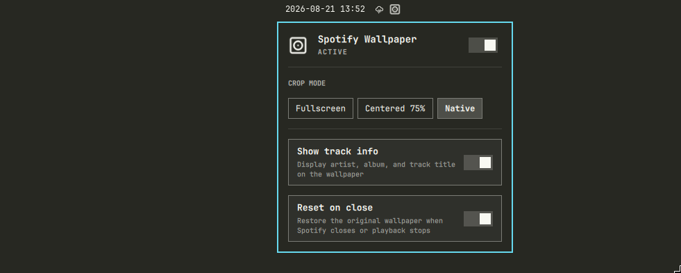
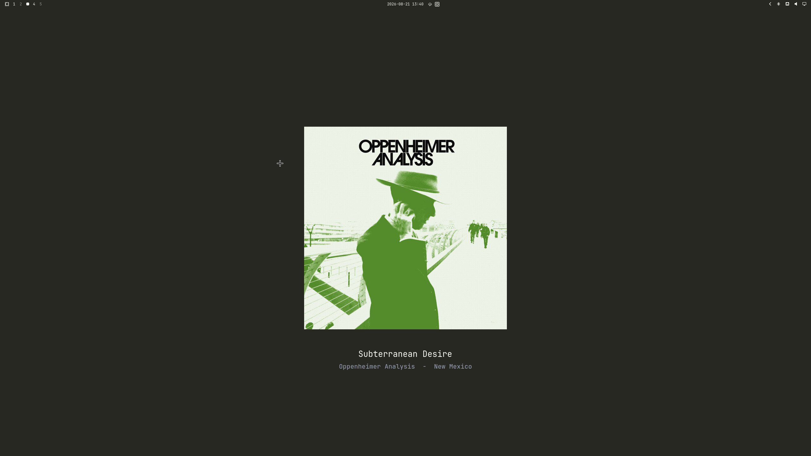
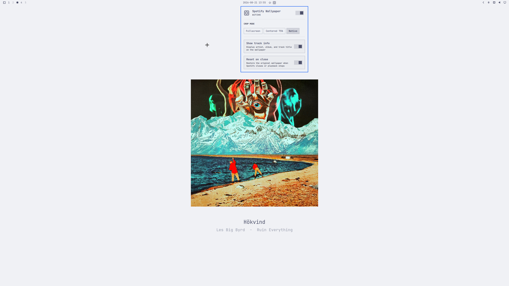
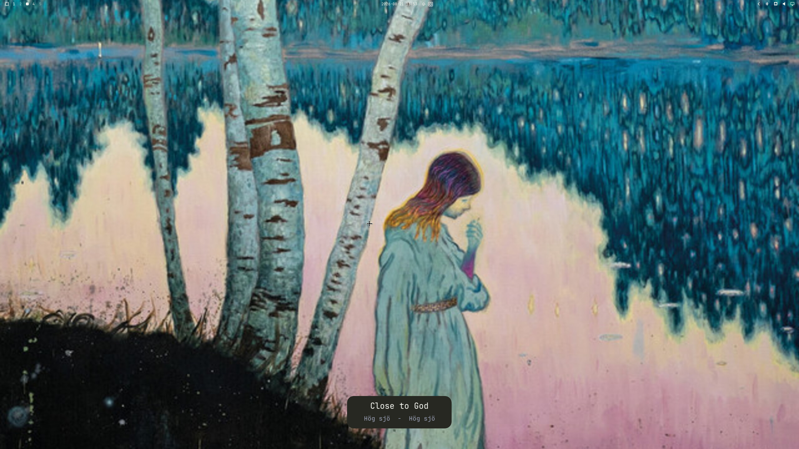

# Spotify Album Wallpaper

Shows the currently playing Spotify album art as your desktop wallpaper.
Restores the original theme wallpaper when playback stops or Spotify closes.

Works with both the official Spotify client and
[Omarchy Spotify](https://github.com/stappmus/Omarchy-Spotify) — any MPRIS
player with "spotify" in its name is detected automatically.

## Features

- Album art becomes the desktop wallpaper while music plays
- Three crop modes: **Fullscreen**, **Centered 75%**, **Native** resolution
- Optional track info overlay (artist – album – title) rendered in the current
  theme's colors — pill-style card on fullscreen, below the art on centered modes
- Re-renders automatically on theme switches so colors always match
- Restores your theme wallpaper on pause, stop, or app close (toggleable)
- Settings panel in the Omarchy bar with native panel UI

## Screenshots





## Requirements

- Omarchy (Quattro shell)
- `playerctl`, `jq`, `imagemagick`, `curl`

```sh
omarchy pkg add playerctl jq imagemagick curl
```

## Install

```sh
omarchy plugin add https://github.com/emilsall/omarchy-spotify-wallpaper.git --enable
```

That's it — when the widget first loads, it detects that its background
service is missing and runs the bundled `install.sh` automatically. The
script installs a systemd user service (starts with your session) and a
`theme-set` hook, and verifies dependencies. If dependencies are missing,
the settings panel shows what to install and offers a retry button.

If you ever need to run the setup manually:

```sh
~/.config/omarchy/plugins/emilsall.spotify-wallpaper/install.sh
```

## Usage

Click the disc-album icon in the bar to open the settings panel. Right-click
the icon to quickly toggle the plugin on/off.

| Setting | Description |
|---------|-------------|
| Enabled | Master on/off. Turning off restores the original wallpaper. |
| Crop mode | Fullscreen (center-crop fill), Centered 75% (75% of shortest screen dimension), or Native (original art size) — centered modes letterbox on the theme background color. |
| Show track info | Overlay artist, album, and track title using theme colors and the current Omarchy font. |
| Reset on close | Restore the original wallpaper when Spotify closes or playback stops. When off, the last album art stays as the wallpaper. |

Removing the widget from the bar (or `omarchy plugin disable`) also disables
the wallpaper service — the widget's presence in the bar layout is what
activates it.

## Uninstall

```sh
cd ~/.config/omarchy/plugins/emilsall.spotify-wallpaper
./uninstall.sh
omarchy plugin remove emilsall.spotify-wallpaper
```

The uninstall script restores your wallpaper, stops and removes the systemd
service, removes the theme-set hook, and cleans cached album art.

## How it works

A small systemd user service polls MPRIS every 2 seconds via `playerctl`.
When a Spotify player is playing, it downloads the album art, composites it
with ImageMagick (crop mode + optional track info in theme colors from
`colors.toml`), and applies it with `omarchy theme bg set`. When playback
stops or the player disappears, the original wallpaper is restored.

Files it manages (safe to delete):

- `~/.local/state/omarchy/spotify-wallpaper/` — state (original wallpaper path, theme reference)
- `~/.cache/omarchy/spotify-wallpaper/` — downloaded and processed album art

## Development

Editing files under `~/.config/omarchy/plugins/<id>/` triggers Omarchy's
plugin hot-reload, but bar widget *components* are not reliably rebuilt in
place — after changing `BarWidget.qml` or `Panel.qml`, run
`omarchy restart shell` to be sure the bar is running your latest code.
The bash service only needs `systemctl --user restart omarchy-spotify-wallpaper`
after editing `spotify-wallpaper.sh`.

## Support me
If you like the plugin you can buy me a coffee: 
https://buymeacoffee.com/emilsall

## License

MIT
